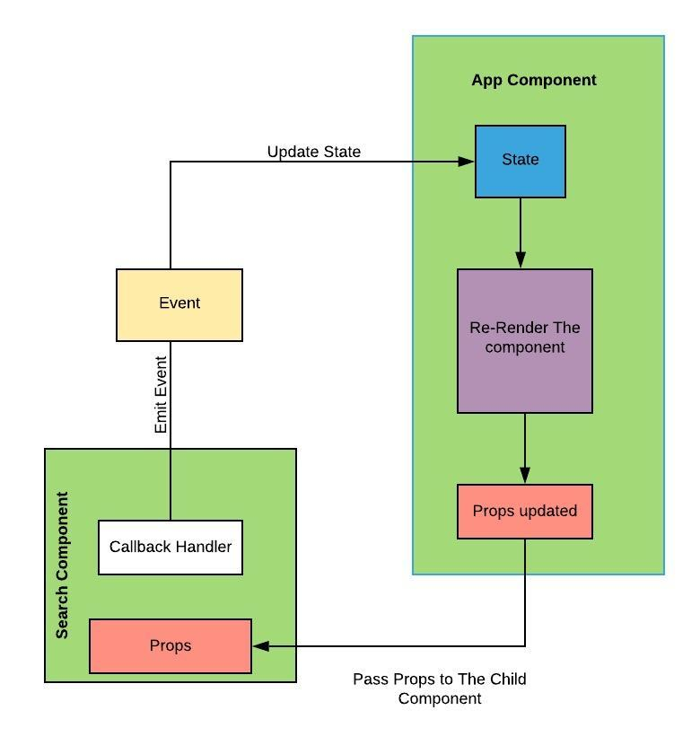

This project was bootstrapped with [Create React App](https://github.com/facebook/create-react-app).

## Important
In this project we discover how to lifte state in React   
Notice that we must always manage the state at the component where every component that's interested in, it is one that either manage the state
(using information directly from state )
or a component below the managing component (using information from props) .
If a component below needs to update the state pass , so we passe a CALLBACK HANDLER in it (the sub component)
and if a component below need to use the state (Eg displaying it ) pass it down as dropdown 
Fr: Il faut placer la gestion du state dans le component qui interesse les autres components qui y vienent pour chercher l'information 

See the schema below to visualise Interactions 
